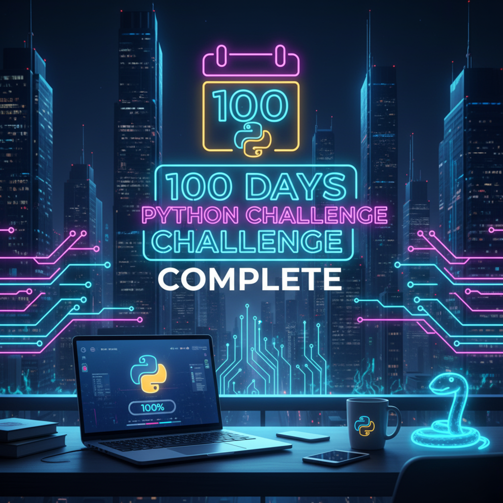

# 100 Days of Python 🧠🐍

*(Building 100 projects in 100 days with Python)*

> 
> 

## About This Challenge

I’m embarking on the [100 Days Of Code](https://www.udemy.com/course/100-days-of-code/?utm_source=adwords&utm_medium=udemyads&utm_campaign=Search_DSA_Alpha_Prof_la.EN_cc.India_Subs&campaigntype=Search&portfolio=India&language=EN&product=Subs&test=&audience=DSA&topic=Python&priority=Alpha&utm_content=deal4584&utm_term=_._ag_185390583313_._ad_769665429044_._kw__._de_c_._dm__._pl__._ti_aud-2297301418005%3Adsa-1652644802545_._li_9220377_._pd__._&matchtype=&gad_source=1&gad_campaignid=22900574864&gbraid=0AAAAADROdO2OFcDhzokidA45wx6o6fZO7&gclid=Cj0KCQiA5uDIBhDAARIsAOxj0CGv3rG6vst28KOFjUqmRe49xYQPbaFclHqK3iYV7hRJIszaPsIGtpoaAisxEALw_wcB&couponCode=PMNVD2025) style challenge: **one small project each day for 100 days**, using Python to learn, build and grow.

This journey is based around the course *“Master Python by building 100 projects in 100 days”*, where I’ll explore automation, data-science, web apps, games, GUIs and more.

## Why I’m Doing This

- Build the habit of coding **daily**, staying consistent rather than doing random bursts.
- Try out lots of different Python tools, frameworks and libraries (Flask, Pandas, Selenium, etc.).
- Create a solid **portfolio** of 100 real projects that I can show off.
- Reflect on what I learn each day, get better at problem-solving, debugging, thinking like a developer.

## Goals

| Goal | Description |
| --- | --- |
| 📅 Finish 100 Projects | Create one project every day, for 100 days. |
| 🔧 Explore Many Areas | Web, automation, games, data-science, GUI, APIs. |
| 📚 Document Daily | Log a short summary each day: what I built, challenges, what I learned. |
| 💼 Build Portfolio | Make each project visible on GitHub (with code + short write-up). |
| 📈 Reflect & Grow | At week-ends/month-end I’ll reflect what went well / what I struggled with. |

## How This Repo Is Organized

```python
/100-Days-of-Python/
│
├─ Day01/
│ ├ [day01.py]
│ └ [README.md] ← what I built + notes
│
├─ Day02/
│ ├ [day02.py]
│ └ [README.md]
│
…
│
├─ [README.md]

```

## Why Share Publicly?

Putting this publicly on GitHub helps me stay accountable (for myself mostly). It shows employers or collaborators a **real record of learning and output**. Also, the #100DaysOfCode community is supportive — sharing helps me connect, get feedback, and stay motivated.

## Rules & Commitment

- I’m committing to work **at least 1 hour** every day on a project.
- I’ll push my code daily (or if less, I’ll log the attempt / learning).
- If I do miss, I’ll still log what happened and get back to it the next day.

## Tools & Environment

- Python version: e.g., **3.x**
- IDE/Editor: e.g., PyCharm / VS Code
- Platform: Windows / Mac / Linux (your choice)
- Key libs & frameworks I expect to use: `Flask`, `Pandas`, `NumPy`, `Matplotlib`, `Selenium`, `Tkinter`, etc.

## Let’s Connect

If you’re doing a similar challenge, drop me a message / link. Always happy to swap ideas or collaborate.

**Hashtag:** `#100DaysOfCode` / `#100DaysOfPython`

---

**Let’s code. Let’s build. Let’s grow.** 🚀

---